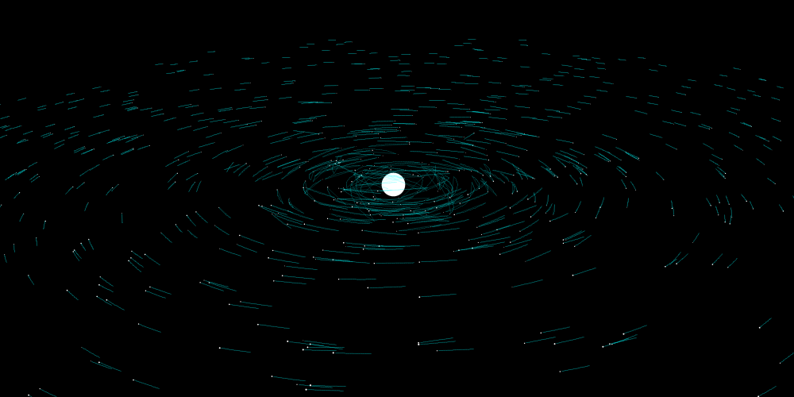

N-Body
======

This is a real-time n-body simulation written in C#. It calculates forces using a multithreaded implementation of the Barnes-Hut algorithm. Various systems (planetary, binary, etc) can be modelled, and I took advantage of my Lattice library to do the 3D drawing. 

